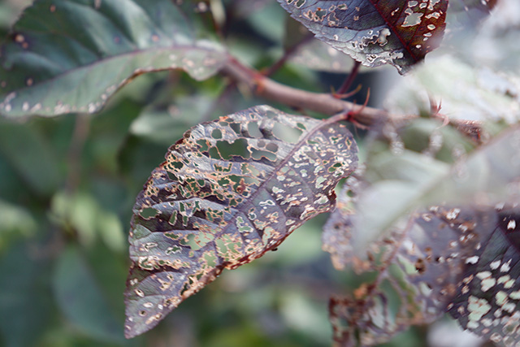

So it turns out keeping photos nice and crispy is harder than I thought.  Just starting out, I decided to take some photos in our garden.  I figured I would put everything in manual mode so I can learn more.  Turns out, what I thought would be the easiest part, turns out I suck at.  Go figure.  Using the focusing dial, I just can't seem to find when things are tack sharp through the viewfinder.  I move it back and forth to find the sweet spot.  And I swear to myself it's sharp when I take the photo.  I suspect I just have a stupid shaky hand that is throw things off.  I'm going to share the lessons I learned from this experience.

### Lesson #1: Pay Attention to Shutter Speed

If you have a heavy trigger finger like me, or are in a strange position where you need to balance to take a shot.  Good chance you're going to shake the camera like an unbalanced washing machine.  So pay attention your shutter speed, and squash that motion blur.  There was no excuse for the blur I had in my shots.  I had plenty of light, shooting at the lowest ISO.  There was plenty of opportunity for me to speed up the shutter speed.  Lesson learned.

### Lesson #2: Actual Try and Stay Still

This wasn't even in my thought process.  I just click the button, I get a picture.  I was probably holding my bloody camera like I do my phone when taking a pick.  Out from my body, and all loosy goosy.  The lesson for me...lock down the stance.  Get the arms in tight, create a stable base.  Be the tripod.  Envision zen calmness and stillness, then squeeeeeeeze the trigger...er...button.

### Lesson #3 Buy a Tripod

Ultimately my goal for photography is to do more landscape type stuff.  And with out a doubt there is going to be low light situations.  Well worth the money to invest in a tripod.  Better to have it and not need it, than the other way around.

### Lesson #4 Know When to Use Auto Focus, and When Not Too.

I partially switched to manual focusing because autofocus was driving me nuts.  I think my camera has a nine point system or something like that.  What you're focusing on needs to be on one of those nine squares, and it'll focus on that.  I was fighting with it.  For example, there was a bee in the middle of the flower.  I wanted to focus on the bee.  It kept focusing on the petals of the flower which drove me NUTZ!  Just focus on the damn bee!  So I switched to manual.  Later, I read there are different focus modes which would have solved my problem...the more you know!  Oh...for the absolute beginners, **AF** on your lens means auto-focus, and **MF** means manual focus.   Thought I'd throw that in there.  It seems pretty self explanatory, but just incase.  There are so many abbreviations on the camera.  If you're not in the know, you better look it up.

### Keep it Crispy

Hopefully by next post, I'll be bragging about how friggen sharp my pics are.  Only time will tell.  Hopefully, you'll be able to learn from my mistakes instead of making them yourself.