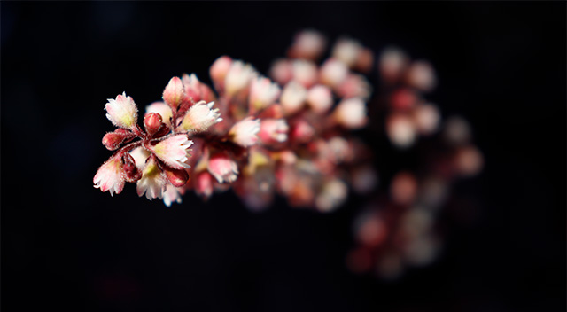

As I'm learning about the camera's workings and how to get proper exposure, one thing came up that surprised me.  All the articles I've read, and videos I've watched about aperture settings left this out.  They simply said, aperture settings determines how narrow the focal plain is.  In turn, how blurry the out of focus part of your image will be. I believe the term is called **Bokeh**.  For example if you use a large f-stop number (f22), everything in your image should be tack sharp.  If you use a lower f-stop number (say f5.6), only the part you focused on will be sharp. At least that is what I was told.   As I was shooting I was noticing whenever I had my lens at a shorter focal length, the blur looked different from what it looked like when I had a longer focal length.   Sooo....I did an experiment to see what the hell was going on.

### The Experiment

Pretty simple. Line up some things on the floor that has consistent spacing.  Something like a ruler.  I used my kid's toy magnetic building blocks.  And have something to focus on.  I used Mrs. Happy (keeping with the adult theme here).  Then I used an f-stop that would give me some nice blur. (f5.6 - this is the lowest my kit lens could do). I then took several shots at several focal lengths.  Making sure my "ruler" stayed consistently at the bottom of my frame.   That's it.

### The Results

#### 18mm @ f5.6

#### 24mm @ f5.6

#### 35mm @ f5.6

#### 55mm @ f5.6

I thought it was pretty cool to see how the focal length really flatten things out.  And also the distortion that takes place at different lengths. Kind of interesting.  Anyway, looking at the difference of the blur between18mm and 55mm, you can see a drastic difference.  The first square is completely blurred out at 55mm, along with the background.  At 18mm, the first square is a little blurred, and the background is almost sharp.  The focal length really lengthens the focal plain.  In the 55mm test, the focal plain starts just before Mrs. Happy, and almost directly after her.  With the 18mm, the plain is almost the entire length of the squares.  Crazy.  Who knew.  I guess a lot of you probably already did.  From a beginner's perspective this is a new tool to be exploited.

### The Take Away

Now that I realize what is going on, I'm going to try a use this more and more.   I've been taking a lot of shots of close up flowers in our garden to practice.  One thing I struggle with is getting all of the flowers in focus some times.  I usually zoom all the way in, which makes the focal plain incredibly narrow.  So if I'm shooting anything that has any kind of depth, only part of the subject is in focus.  Now knowing the results from this test, I can just zoom out a bit if I need the extra light from using a large aperture.  Kinda cool.  Isn't photography neat. 