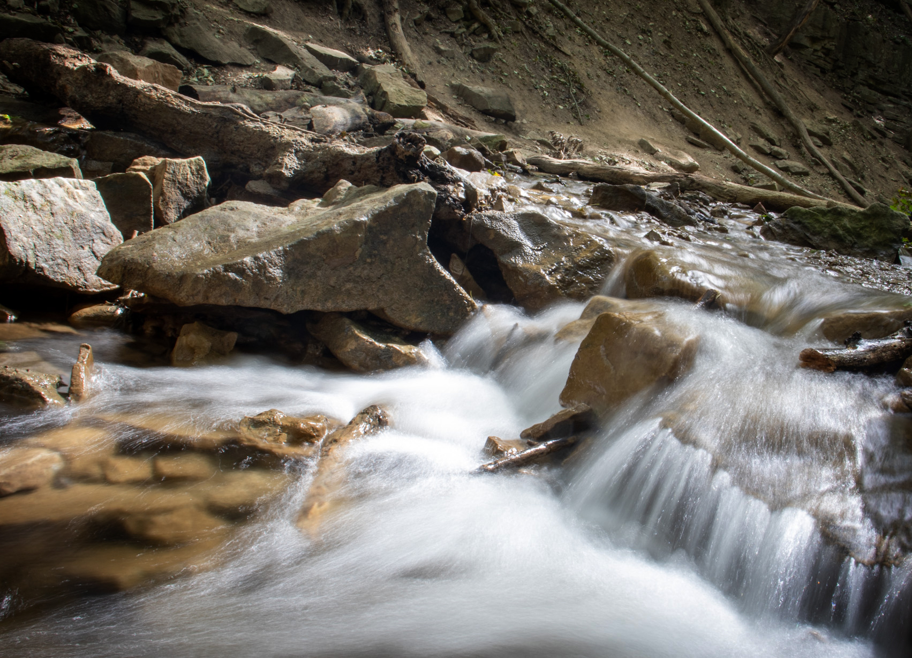

I'm happy to say I bought a tripod finally.  My struggle with shaky hands is at an end.  Shopping for one was tricky.  There are just so many options.  I ended up getting a Manfrotto as a compromise of quality and cost.  There are some seriously nifty tripods out there with all the doodads and whatchamacallits. Having never used one before, I couldn't tell which features really matter and which don't.  After using my tripod a bit now, I have a little more insight.

## Overall Experience

While shooting, and setting up a shot.  I love the tripod.  You just set it up the way you want it, and forget it.  You know you're going to get a sharp shot.  Also not having to worry about your shutter speed is fantastic!  Getting some cool and creative shots that longer exposures offers is definitely a plus.  What sucks is the effort it takes to set it up. Even with only 3 legs, the amount of time it takes to get it out of your bag, and get the legs extended is a pain.  I found myself opting to shoot free hand because I didn't want the hassle.  But, if there was a shot that I was really committed to.  It was worth the effort.  I suspect the more I practice with the tripod the easier it'll get.

## Ball Heads Matter

So ball heads...love 'em and hate mine.  The actual mechanism of moving your camera around is fantastic.  All that freedom a man could get use too.  What sucks is the way I have to attach my camera.  Mine has what is supposed to be a quick release.  It has a button you press with your finger, then slide a leaver you slide with your thumb while the button is pressed.  This sucks for a couple of reasons.  The lever itself is stiff.  I find myself trying to use 2 hands to try and trigger the mechanism.  You could imagine this would be difficult with a camera in your hands.  I can appreciate this did this so that your camera doesn't slip off the tripod.  The other thing I struggled with was switching hands.  Sometimes I had to use my right, others my left.  And with this mechanism I find it favours my right hand over my left.  In hind sight, if I were to go shopping again, I would make sure the attachment mechanism was something people loved.

## Weight

This one is always a feature that is brought to the forefront in the advertisements of the tripods.  Personally, I didn't mind the weight in my backpack. I think cameras and lenses will be far heavier than the tripod. An extra pound or two is not a big deal in my eyes.  I fluctuate that much weight in a day.  I get hiking you want as little weight as possible.  I guess because I'm a big guy I really didn't notice anything.   After all said and done, if I were to shop again, I wouldn't consider the weight.  Heavier ones could probably be cheaper.

## Build Quality

I think this one is important.  I can see pulling out your tripod, over and over again can lead to some serious wear and tear.  Especially if you're shooting in cold climates.  Avoid plastic parts.  I'm happy to say my tripod seams pretty solid.  I was pleasantly surprised when I first got it.  Nothing rattles, everything is smooth.  It is a pleasure to use...except the ball head.  Damn ball head.

## Tripod it up

So that's my two cents for what its worth. I can appreciate the engineering that goes into making these things.  I'll definitely be making use of my new tripod.  I'm excited to try some more longer exposure stuff.

